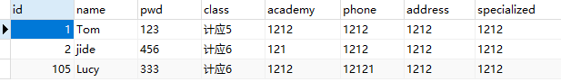
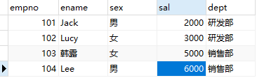

# mysql 基础语法
## 注意事项
1.语句写完要以 ; 结尾  
2.语句中如果有字符串要以' '包裹
## 判断操作符
下表中实例假定 A 为 10, B 为 20

| 操作符  | 描述                         | 实例  |
|------|----------------------------|-----|
| **=** | 等号，检测两个值是否相等，如果相等返回true    | 	(A = B) 返回false。 |
| **!=**，**<>** | 	不等于，检测两个值是否相等，如果不相等返回true | 	(A != B) 返回 true。 |
| **<**  | 略                          |  略 |
| **<=**   |  略                        |  略 |
| **>**  |  略                        |  略 |
| **>=**  |  略                        |  略 |

## like的用法示例
| 示例   | 描述                      | 
|------|-------------------------|
| '张'  | 和=相同                    |
| **'%'** | **表示零个或多个字符**           |
| '张%' | 匹配所有以张开头的字符串            |
| '%张' | 	匹配所有以张结尾的字符串           | 
| '%张%' | 	匹配包含张的字符串              | 
| '**_**' | 	 **通配符表示一个字符**         | 
| '_a%' | 	表示第二个字符为a的所有字符串        | 
| 'a%o_'   | 	表示以a开头，最后第二个字符为o的所有字符串 | 

### UNION操作符 
用于连接两个以上的 SELECT 语句的结果组合到一个结果集合，并去除重复的行
### ORDER BY
用于升降序排列

```sql
SELECT * FROM employees
ORDER BY department_id ASC, hire_date DESC;
```
### 分组 group by 
根据分组的字段 查询数据总量

## 插入语句
```sql 
INSERT INTO user (name, age, sex,remark)
VALUES ('张三', 18, '男','dsadsaoidjsi');  
//向user表中插入一条数据，name为张三，age为18，sex为男,remark备注
```

## 查询语句
``` sql
select * from user where id = 1 and name like '%张三%' and ;
```
\* 代表 要查询的字段  
user表示查询的是user表  
where代表筛选条件 查询id=1的数据  
and代表并且  
like代表模糊查询  


## 更新语句

``` sql
update user set name = '张三' where id = 1;
//更新id=1的数据，把该数据的name值更新为张三 
```
## 删除语句
```sql
delete from user where id = 1;
删除user表中id为1的数据
```

## 实战
#### **user表**



```mysql
-- 插入一条数据
-- INSERT INTO `user` VALUES(103,'Lucy','333') ; 

-- 修改信息·
-- UPDATE `user` SET pwd='444' WHERE id=103;

-- 删除
-- DELETE FROM `user` WHERE id=103;

-- 查询
SELECT * FROM `user`;

SELECT * FROM `user` WHERE id=104;

SELECT * FROM `user` WHERE name='Tom' AND pwd='123';

-- 模糊查询

SELECT * FROM `user` WHERE name LIKE 'T%';
-- 插入一条数据
INSERT INTO `user` (`name`,pwd) VALUES('Lucy','333') ; 
```


#### **emp表**



```mysql
-- 统计公司人数
SELECT COUNT(*) FROM emp;

-- 统计研发部门总人数

SELECT COUNT(ename) FROM emp WHERE dept='研发部';

-- 统计不是研发部门总人数

SELECT COUNT(ename) FROM emp WHERE dept!='研发部';

-- 统计所有员工的最高工资

SELECT MAX(sal) FROM emp;

-- 求研发部，销售部的最高最低工资

SELECT MAX(sal) FROM emp WHERE dept='研发部';

SELECT min(sal) FROM emp WHERE dept='研发部';

SELECT MAX(sal) FROM emp WHERE dept='销售部';

SELECT MIN(sal) FROM emp WHERE dept='销售部';

-- 统计所有员工的总工资
SELECT SUM(sal) FROM emp ;

-- 求所有员工的平均工资
SELECT AVG(sal) FROM emp;

-- 求各个部门的工资总和，平均工资
SELECT SUM(sal) FROM emp WHERE dept='研发部';

SELECT AVG(sal) FROM emp WHERE dept='研发部';

SELECT SUM(sal) FROM emp WHERE dept='销售部';

SELECT AVG(sal) FROM emp WHERE dept='销售部';

-- limit 从0索引开始查两条数据

SELECT * FROM emp LIMIT 0,2;

```


