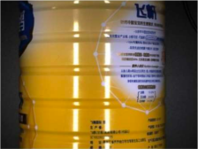
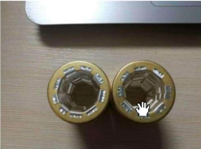
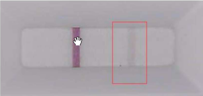
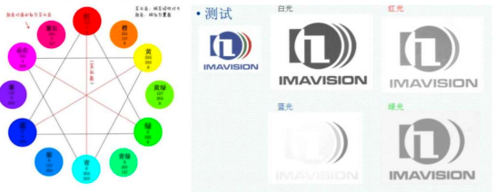
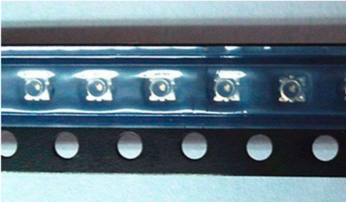
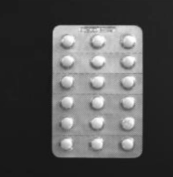
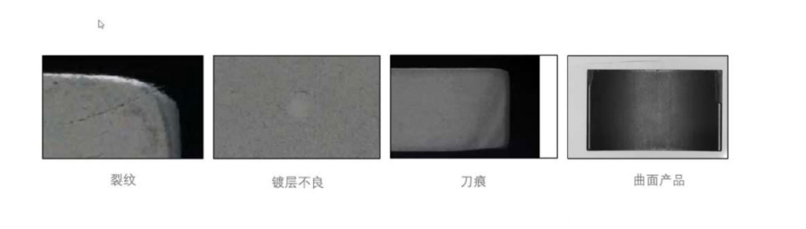

## C#面试题

### 什么是类

类是创建对象的模版。它是包含属性和方法，我们可以从一个类中创建许多对象实例

### 面向对象的概念是什么

封装、抽象、多态和继承是面向对象的编程的主要概念

1. 封装是指将对象的状态（属性）和行为（方法）封装在类中，并控制外部对这些属性和方法的访问，通过封装，可以隐藏对象的内部实现细节、只暴露必要的接口，从而增强代码的安全性和可维护性
2. 继承:允许一个类从另一个类继承属性和方法，从而实现代码复用，通过继承，子类可以扩展或修改父类的行为
3. 多态：允许对象在不同的上下文中表现为不同的形式，多态有两种方式
   - 编译时多态（静态多态）：通过方法重载实现
   - 运行时多态（动态多态）：通过方法重写实现

### 什么是对象

对象是一个类的实例，我们通过它访问该类的功能，我们可以使用new关键字来创建一个对象，在内存中创建对象的类保存有关该函数、数据成员和行为的信息

### 什么是构造函数，他有哪些不同的类型

构造函数就像一个与类同名的方法，但是它是唯一的方法，即使没有创建，编译器也会在创建类的对象时在类的内存中创建一个默认的构造函数。构造函数用于使用一些默认值初始化对象，默认构造函数、参数化构造函数，复制构造函数、静态构造函数和私有构造函数都是不同的构造类型

### C#中的析构函数是什么？

析构函数清楚内存以释放资源，并由垃圾收集器自动管理

### 简述private、protected、public、internal修饰符的访问权限

- private:私有成员，在类的内部可以访问
- protected：保护成员，在该类的内部和继承类中可以访问
- public:公共成员，完全公开没有访问限制
- internal:在同一程序集中可以访问

### C#中的委托是什么？事件是不是一种委托

- 委托是一个类型，类似于C/C++中的函数指针，但比函数指针更安全和灵活。委托可以保存对一个或多个方法的引用，并允许在稍后调用这些方法。
- 一个委托可以指向多个方法，这种功能称为多播委托。
- 事件是一种特殊的委托，用于通知订阅者某个动作已经发生。事件本质上是委托的一个封装，通常用于发布-订阅模式。事件只能在类的内部触发，而不能从外部调用，因此提供了一种安全的机制来触发回调。

### 请使用编程实现一个冒泡排序

```csharp 
int[] array = new int[] {1,2,3,4};
for (int i=0;i<array.Length -1 ; i++){
  for (int j=i+1;j< array.Length ; j++){
    if (array[j]< array[i]){
    int temp = array[i];
     array[i]= array[j];
     array[j]=temp ;}
  } 
}

```

### CTS、CLS、CLR分别作何解释

- CTS、CLS 和 CLR 是 .NET 框架的核心概念，它们定义了 .NET 平台上语言互操作性、类型系统和运行时环境的基本原则

1. CTS（Common Type System，通用类型系统）
   - 定义了 .NET 运行时支持的所有数据类型，确保跨语言的类型兼容性
2. CLS（Common Language Specification，通用语言规范）
   - 定义了一组所有 .NET 语言必须遵循的规则，确保不同语言之间的互操作性。
3. CLR（Common Language Runtime，通用语言运行时）
   - .NET 代码的执行环境，负责内存管理、代码执行、安全性、异常处理等基本功能，是 .NET 平台的核心。

### 什么是拆箱和装箱

- 装箱：将值类型转换为引用类型的过程
- 拆箱：将引用类型转换回值类型的过程
- 性能考虑：频繁的装箱和拆箱操作会带来性能开销，建议通过使用泛型等方式来减少这种操作

### c#中string str=null和string str=""尽量用文字或图像说明其中的区别

- null:表示字符串对象没有指向任何对象，及没有被分配内存空间，对其进行操作会抛出NullReferenceException异常，因为它并不指向实际的字符串对象。
- "":表示字符串被赋值为了空字符串，分配了内存空间，可以对其进行相应的操作

### 请详述在dotnet中类class和结构struct的异同

1.值类型和引用类型

- 结构是值类型，分配在栈中，将结构的实例传递给方法或者赋值给另一个变量时，将复制整个结构的内容
- struct是引用类型，分配在堆中，将类的实例传递给方法或者赋值给另一个变量时，实际上时传递的内存地址

2.继承和多态性

- 结构不能继承：结构不能继承其他结构，也不能被其他结构继承
- 类支持继承：类支持继承和多态性，可以通过派生类来扩展现有类的功能

3.默认构造函数

- 结构不能有无参的构造函数

- 类可以有无参的构造函数，如果没有构造函数，会默认提供一个无参的构造函数

4.可空性

- 结构体是值类型不能直接设置为null，null是引用类型的默认值，如果需要，可以使用 `Nullable<T>`或T？的可空类型
- 类默认为null

### 枚举的作用是什么

- 枚举是一组命名整型的常量，是值类型，使用enum关键字声明
- 通常用于表示有限的、固定的值集合
- 作用：
  1. 提升代码的可读性：通过具名常量，使代码更清晰
  2. 增强代码的安全性：限制变量的有效范围
  3. 简化维护：集中管理常量集合，减少维护成本
  4. 类型检查：编译时确保类型安全，防止非法值的使用

### 保存数据的方法

1. 文本保存(用于保存简单的文本数据)
   ```csharp
   //写入文本文件
   File.WriteAllText("data.txt","保存的文本数据");
   //读取文本文件
   string content = File.ReadAllText("data.txt");
   ```

2. 二进制文件保存（适用于保存图像、音频等非文本数据）

```csharp
// 写入二进制文件
byte[] data = new byte[] { 0x00, 0xFF, 0xAB };
File.WriteAllBytes("data.bin", data);

// 读取二进制文件
byte[] readData = File.ReadAllBytes("data.bin");
```

3. XML文件保存

```csharp
//创建
//实例化xml对象      
XmlDocument xmlDocument = new XmlDocument();
//设置第一行数据       
XmlDeclaration xmlDeclaration =xmlDocument.CreateXmlDeclaration("1.0", "utf-8", null);
//将第一行数据添加       
xmlDocument.AppendChild(xmlDeclaration);
//创建xml文件根节点       
XmlElement root = xmlDocument.CreateElement("root");
//将根节点添加       
xmlDocument.AppendChild(root);
//保存数据
xmlDocument.Save("file.xml");

//读取文件
     public static XmlNodeList LoadFileList(string path) {
       //实例化xml文件对象 
       XmlDocument xmlDocument = new XmlDocument();
       //根据文件路径加载xml文件  
       xmlDocument.Load(path);
       //获取xml文件根节点  
       XmlElement root = xmlDocument.DocumentElement;
       //返回xml文件根节点的字节点 
       return root.ChildNodes;
     }
```

4. 数据库保存 （略）
5. 配置文件保存
   - config 文件常用于保存应用程序的配置信息，通常在 ASP.NET 或桌面应用程序中使用

### c#多线程经常访问同一个资源可能造成什么问题

1. 竞争条件
   - 问题：多个线程同时对共享资源进行读写操作，没有同步机制的保护，每个线程操作可能会互相覆盖，导致最终数据不准确
   - 解决：使用 lock 关键字保护临界区，确保同一时刻只有一个线程能够访问共享资源。

2. 死锁
   - 问题：死锁发生在两个或多个线程相互等待对方释放资源，导致程序卡住，无法继续执行。例如，线程A持有资源1，等待资源2，而线程B持有资源2，等待资源1。这种情况会导致两个线程永久地阻塞。
   - 解决：互斥量（Mutex）**，与 lock 类似，但 Mutex 可以用于跨进程同步，确保不同进程间的资源访问是互斥的。

3.资源争用：

- 问题： 资源争用发生在多个线程尝试同时访问某个资源，导致系统性能下降。常见的资源争用包括多个线程同时读写同一个文件、数据库记录、内存块等。

  由于多个线程争夺同一个资源，系统必须排队处理这些请求，导致处理效率降低。如果争用严重，可能会导致系统响应时间变长甚至停滞。

- 解决：信号量（Semaphore）：限制对共享资源的并发访问数量。例如，允许最多三个线程同时访问某个资源。

4.饥饿

- 问题：饥饿问题发生在某些线程由于系统调度策略或资源分配问题，长期得不到执行机会，导致其无法完成工作。饥饿的一个常见例子是高优先级线程频繁占用资源，导致低优先级线程一直无法获取资源
- 解决：读写锁（ReaderWriterLockSlim）：用于解决读写操作之间的冲突，允许多个线程同时读取数据，但写操作需要独占锁。

5.  活锁（Livelock）

   - 问题：活锁和死锁类似，但有所不同。活锁是指线程并没有被真正阻塞，而是不断地重复尝试某个操作（通常是为了避开死锁），但总是失败，导致程序无法继续执行。尽管线程仍在运行，但却无法取得进展。

   - 线程安全集合（Thread-Safe Collections）：使用 .NET 提供的线程安全集合类（如 ConcurrentDictionary, BlockingCollection）来管理共享数据，这些集合内部已经处理了线程同步问题。
6. 数据不一致性

   - 在没有适当同步的情况下，多个线程同时读取和修改共享数据会导致数据不一致。例如，多个线程对同一个变量进行操作时，由于每个操作可能由多个步骤组成，因此在某个线程操作尚未完成时，其他线程可能读取到了错误的中间状态。

### 简单说明线程与进程的区别

进程：是一个正在执行的程序的实例，就是在内存中运行的应用程序，每个进程都有自己独立的内存空间，进程与进程之间无法访问彼此的资源，多个进程可以并发执行，进程可以有多个线程，一个进程崩溃不会影响其他进程

线程：进程内的执行单位，多个线程可以共享进程的资源，一个线程崩溃可能导致整个进程崩溃

- 线程的创建和切换开销较小，通信方便，但是要注意线程同步问题，进程隔离性更好，但是资源占用比较高
- 进程可以包含多个线程，进程负责管理内存、文件、网络连接等资源，线程负责实际的任务执行


### 简单说明单线程和多线程的区别

1. 执行模式
   - 单线程：在单线程模式下，程序只有一个执行线程，所有任务都必须按顺序执行。这意味着一个任务必须完成之后，才能开始执行下一个任务。单线程程序无法同时处理多个任务
   - 多线程：在多线程模式下，程序可以同时创建多个线程，每个线程可以并发执行不同的任务。这种并发执行方式允许程序在相同的时间段内处理多个任务，提高效率。

2. 并发性
   - 单线程：由于只有一个线程，所以没有并发性。程序在处理耗时操作（如文件I/O、网络请求等）时，可能会卡住，导致整个程序暂停，直到该操作完成。
   - 多线程：多线程程序通过并发执行多个任务，提升了程序的响应能力。例如，在GUI应用中，主线程可以负责用户界面渲染，另一个线程处理后台任务，这样即使后台任务较慢，界面也不会被冻结。

3. 资源利用率
   - 单线程程序只能利用一个CPU核心，无法充分利用多核CPU的性能优势。如果有多个处理器核心，单线程程序只能使用其中的一个，限制了计算能力。
   - 多线程程序可以充分利用多核处理器的优势。不同的线程可以分配到不同的处理器核心上执行，从而提升并行处理能力，提高资源利用率和执行效率。

### c#内存泄漏

- 通常指的是程序在运行过程中无法正确释放已分配的内存，导致内存占用持续增加，最终可能导致系统内存不足

**常见原因**

1. 事件处理器未解除订阅
   - 在C#中，如果对象订阅了某个事件，而事件源对象的生命周期长于订阅者对象，那么即使订阅者对象不再需要，仍然会因为事件源对它的引用而无法被垃圾回收。除非显式地解除订阅，否则订阅者对象将会一直保留在内存中，导致内存泄漏。
   - 解决：在对象销毁之前，确保解除所有事件订阅，或者使用弱事件模式来避免事件处理器导致的内存泄漏。

2. 未释放的非托资源
   - C#中的托管对象由垃圾回收器自动管理，但对于非托管资源（如文件句柄、数据库连接、网络套接字、GDI+对象等），垃圾回收器无法直接处理。必须手动释放这些资源，否则它们将一直占用内存，导致内存泄漏。
   - 解决：解决方法是实现 IDisposable 接口，并在 Dispose 方法中释放非托管资源。

```csharp
public class MyResource : IDisposable
{
    private IntPtr _unmanagedResource;

    public MyResource()
    {
        // 分配非托管资源
    }

    public void Dispose()
    {
        // 释放非托管资源
        if (_unmanagedResource != IntPtr.Zero)
        {
            // 调用操作系统函数释放资源
            _unmanagedResource = IntPtr.Zero;
        }
        GC.SuppressFinalize(this);
    }

    ~MyResource()
    {
        Dispose();
    }
}
```

3. 静态变量持有对象引用
   - 静态变量的生命周期与应用程序的生命周期一致，因此如果静态变量持有某个对象的引用，那么该对象将无法被垃圾回收，从而导致内存泄漏。
   - 解决：解决方法是谨慎使用静态变量，确保在不需要时手动清除引用。

4. 长生命周期对象对短生命周期对象的引用
   - 如果一个长生命周期的对象（如单例或全局对象）持有对短生命周期对象的引用，那么短生命周期对象将无法被GC回收，导致内存泄漏。一个典型的例子是缓存数据的全局字典。
   - 解决：是在对象不再需要时及时移除引用，或者使用弱引用（WeakReference）避免对象被长时间持有。

5. 循环引用
   - 循环引用在托管环境下通常不会导致内存泄漏，因为垃圾回收器可以检测并清理循环引用。但在某些复杂场景中，例如两个对象之间相互持有非托管资源或事件订阅，这样的循环可能会导致内存泄漏。

6. Timer 和后台线程
   - 如果使用 System.Timers.Timer 或 System.Threading.Timer，并且没有正确停止或释放计时器，它将继续引用目标对象，导致目标对象无法被垃圾回收。
   - 解决：是在不需要计时器时显式调用 Dispose 方法

### SDK

SDK，即 Software Development kit 的缩写，译作软件开发工具包。.软件开发工具包是一个覆盖面相当广泛的名词，你甚至可以这么理解:辅助开发某一类软件的相关文档、范例和工具的集合都可以叫做 SDK。

## 硬件选型面试题

###  相机选型 

1. **分辨率**

    分辨率决定了相机捕捉到图像的细节程度，高分辨率相机会生成更多的像素数据，适合需要精细检测应用，但同时，图像处理的负担也大

2. **帧率**

   **帧率**（FPS, Frames Per Second）指相机每秒能够捕捉的图像帧数。如果你的应用需要捕捉高速运动物体，比如生产线上的检测，较高的帧率是必要的。

3. **传感器类型**

   **CCD**（电荷耦合器件）和 **CMOS**（互补金属氧化物半导体）是两种常见的传感器类型。CCD 通常具有更好的图像质量和动态范围，适合要求高精度的应用。CMOS 通常速度更快，功耗更低，适合高速应用。

4. **光谱范围**

   **可见光相机**适用于普通成像。如果需要检测不可见光波段，比如红外或紫外，则需要选择相应的**光谱相机**。

5. **接口类型**

   常见的接口有 **USB、GigE、Camera Link、CoaXPress** 等。接口的选择取决于你的传输带宽需求、传输距离以及系统集成的便捷性。

6. **触发模式**

   对于需要精准控制的应用，**硬件触发模式**可能比软件触发更为精确，能够与其他设备实现更好的同步。

7. **相机尺寸**

​       相机的**尺寸**和**重量**需要与机器设备空间相匹配，特别是在空间有限的工业环境中。

8. **软件支持**

   检查相机是否有良好的**SDK**（软件开发工具包）和**驱动**，并支持你使用的操作系统和开发环境。相机厂商提供的图像处理工具也可能是选择的一个重要考虑因素

9. **价格与服务**

   根据预算选择合适的相机

10. **环境要求**

    如果相机在苛刻的环境下工作，比如高温，低温，湿度较大或有震动的环境，则需要相应的防护等级

### 远心镜头的计算方式

- 光学放大倍数 = cdd靶面型号尺寸(V或者H)/视场尺寸(V或者H)
- 系统放大倍率 = 芯片短边/视野短边 = 7.452mm/25mm = 0.29808

### 一些选型的公式

- 焦距 f =WD * 靶面尺寸(H or V) / FOV(H or V)
  - 焦距越小，景深越大，畸变越大，见晕现象越严重，使像差边缘的照度降低
- 视场FOV(H or V) = WD * 靶面尺寸(H or V) / 焦距f
- 视场FOV(H or V)  = 靶面尺寸(H or V) / 光学倍率
- 工作距离WD = f(焦距) / (靶面尺寸/FOV(H or V))
- (焦距/靶面尺寸*视场大小) = 工作距离
- 光学倍率 = 靶面尺寸(H or V) /FOV(H or V)
- 分辨率 = 视野(Field of View) / 像素(Pixel)
- 像素精度 = 分辨率

### 靶面尺寸

- 1英寸  —— 靶面尺寸宽为12.8mm * 高9.6mm
- 1.1英寸  —— 靶面尺寸宽为12mm * 高12mm
- 4/3英寸  —— 靶面尺寸宽为18.5mm * 高13.5mm
- 1/4英寸  —— 靶面尺寸宽为2.4mm * 高3.2mm
- 1/3.6英寸  —— 靶面尺寸宽为4mm * 高3mm
- 1/3.2英寸  —— 靶面尺寸宽为4.54mm * 高3.42mm
- 1/3英寸  —— 靶面尺寸宽为4.8mm * 高3.6mm
- 1/2.5英寸  —— 靶面尺寸宽为5.76mm * 高4.29mm
- 1/2.3英寸  —— 靶面尺寸宽为6.16mm * 高4.62mm
- 1/2英寸  —— 靶面尺寸宽为6.4mm * 高4.8mm
- 1/1.8英寸  —— 靶面尺寸宽为7.18mm * 高5.32mm
- 1/1.7英寸  —— 靶面尺寸宽为7.6mm * 高5.7mm
- 2/3英寸  —— 靶面尺寸宽8.8mm * 高6.6mm

### 曝光和增益一般有什么作用

**曝光时间：** 快门速度，简单来讲就是按下快门的时间，时间越长，光子到CCD\CMOS表面的光子总和越多，采集的图像越亮，如果曝光过度，则照片过亮，失去图像细节，如果曝光不足，则图像越暗，同样会失去图像细节，虽然曝光时间过长一点图像质量会好一些，但是不能无限长，因为曝光过程中，噪点也在增加

**增益：** 经过双采样之后的模拟信号的放大增益，但是对图像信号放大的过程同时也会放大噪声信号

​	曝光和增益是直接控制传感器(CDD/CMOS)上读出的数据，是要优先调节的，以调节曝光时间为主，在不过爆的前提下，增加曝光时间可以增加信噪比，使图像更加清晰，当然对于很弱的信号，曝光也不能无限增加，因为随着曝光时间的增加噪音也会累积，曝光补偿就是增加曝光拍摄时的曝光量

​	增益一般只是在信号弱，但不想增加曝光时间的情况下使用，一般相机增益都产生很大的噪音，工业相机在不同增益时图像的成像质量不一样，增益越小，噪点越少，增益越大，噪点越多，特别是在暗处，数码相机的ISO就是这里说的增益，增大ISO，是增加感光器件对光的灵敏度。高感光度对低光照灵敏，同时也对噪杂信号也灵敏，信噪比小，所以高感光度噪点也多（可以利用图片软件的降噪功能减轻或去除）

​	调节亮度增益说白了就是改变ISO,改变CMOS传感器的感光性能，但是会影响到画质，调节曝光简单来将就是按下快门的时间，时间越长，图片越亮

### 什么是物距

- 指被拍摄物体到凸透镜之间的距离，影响到成像的大小，清晰度，景深，通过调整物距和对焦，可以优化机器视觉或摄影系统中的图像质量

### 红色的背景，白色的字体，该选用什么光源

绿色光源

如果要将目标打成白色需要选用同类色，如果要目标打成黑色，需要选用互补色

1. 如果想变暗的特征是红色则使用绿光
2. 使用绿光能使绿色特征呈现的更亮

### 普通镜头和远心镜头的区别

**普通镜头：** 

 	1. 畸变大（透视失真）：比如，当拍摄一个立方体时，普通镜头的透视效果会使靠近镜头的一面看起来比远离镜头的一面大。
 	2. 物体的大小会随物距的变化而变化
 	3. 镜头解析度不高

**远心镜头：** 

1. 放大倍数恒定

2. 不随景深的变化而变化
3. 无视差（无论物体离镜头远或者近物体的尺寸在图像中都保持一致）
4. 低失真，畸变小

### 了解景深 描述一下景深

- 图像中可以被清晰聚焦的前景和背景之间的距离

- 景深是在聚焦完成后，焦点前后的范围所呈现的清晰图像的距离，这一前一后的范围叫做景深
- 镜头焦距越小，景深越大
- 物距越大，景深越大
- 光圈越小，景深越大

### 相机接口
F型、C型、CS型
 - F接口一般适用于焦距大于25mm的镜头
 - C与CS接口的区别在于镜头与摄像机接触面至镜头焦平面的距离不同，C型接口此距离为17.5mm，CS型接口此距离为12.5mm，C接口镜头使用5mm的c/cs转接环可以安装在CS型接口的摄像机上，反之则不行。

### 视场（Field of View 即 FOV）
- 指观测物体的可视范围，也就是充满相机采集芯片的物体部分
### 工作距离（Working Distance 即WD）
 - 指镜头前部到受检验物体的距离，即清晰成像的表面距离
### 分辨率
 - 图像系统可以检测受检验物体上最小可分辨特征尺寸，在多数情况下，视野越小分辨率越好
### 失真（distortion）
- 又称畸变，指被摄物平面内的主轴外直线，经光学系统成像后变为曲线，则此光学系统的成像误差称为畸变
### 远心镜头
- 为纠正传统工业镜头视差而设计，它可以在一定物距范围内，使得图像放大倍率不会变化，其本质是普通镜头与小孔成像原理的相结合

 

## VisionPro

### 模版匹配里面的算法都有什么？分别有什么用

- PatMax 涉及的点数多，精度比较高，速度稍慢，定位的精度可以为1/40像素
- PatQuick 算法速度快
- PatQuick 与PatMax算法 处于两者中间
- PatFlex算法 比较适合于畸变的情况

### visionPro中掩模和建模的区别

**掩模**：

- 作用：遮掩不必要的像素，消除干扰    
- 使用场景：当只需要边缘轮廓，忽略内部细节时候使用

**建模：** 

- 作用：手动创建一个需要的轮廓

  ---

  通过数学或几何模型来描述或表示图像中的特定对象或形状。建模的目标是识别、定位和测量图像中的物体，甚至在噪声或部分遮挡的情况下也能实现。

**总结**：

- 掩膜用于筛选和排除不相关区域，建模则是为了识别和定位感兴趣的对象
- 掩膜是一种预处理技术，主要用于图像的初步处理；建模是一种高层次的分析技术，涉及到模式识别和对象定位。
- 掩膜通常基于二值图像，而建模涉及到复杂的数学和几何算法。

### 模版匹配颗粒度是什么

可以通过修改粗糙和精细的颗粒度，修改粗糙和精细特征的表现情况

颗粒度变大，选取的特征会变少

本质上颗粒度越大，穿越的像素点就多，包围的轮廓就会变得粗糙

一般选择默认

### 弹性

弹性参数：当实例和当前模板有一定出入的时候（弹性形变），可以进行适当修改

- 弹性匹配是一种灵活的模板匹配方法，能够处理图像中的变形、缩放、旋转等变化。它在需要处理复杂和变形对象的场景中具有重要意义，尽管其计算复杂度较高，但可以显著提高匹配算法的鲁棒性和适用性。

### 边缘阈值

低于边缘阈值的会当作物件的背景，大于阈值的才会视作物件的轮廓（边缘对比度）

如果设置一个过小的阈值会产生过多的干扰

设置一个过大的阈值，将会造成边缘轮廓损失

----

边缘检测的核心是找到图像中亮度或颜色发生剧烈变化的区域，这些变化通常代表物体的边界。边缘阈值的作用是设置一个标准，只有当像素之间的亮度或颜色差异大于这个阈值时，才将其标记为边缘。

- **高阈值**：如果设置的边缘阈值较高，算法会仅检测出图像中最强烈的边缘，忽略细小或弱的边缘。这适合用于噪声较多的图像中，以避免误检。
-  **低阈值**：如果设置的阈值较低，算法会检测出更多的边缘，包括一些较弱或细小的边缘。然而，这也可能导致噪声或微小的图像变化被误认为是边缘。

### 极性

图像的轮廓（从暗到亮是正极性，反之是负极性）

### 接受阈值

结果高于得分接受，低于得分抛弃

### 粒度限制（和创建模板是的参数基本一致）

粒度限制通常指处理过程中对细节或特征的最小尺度限制，即算法或硬件能够有效区分或处理的最小颗粒大小。较小的粒度限制意味着系统能够处理更多的细节信息，而较大的粒度限制则意味着系统只关注较大的整体特征。

### 对比度阈值（背景和工件的切割对比度）

对比度阈值用于设定像素之间亮度差异的最小值。如果像素之间的亮度差异（对比度）低于该阈值，则系统会忽略这些像素的变化，认为它们不构成有效的特征或边缘；如果亮度差异超过阈值，则会被认为是图像中的重要信息

### visionpro中找线工具找圆工具的对比度阈值怎么调

通过查看背景和边缘的像素差调试相应的大小

### c#中通过哪个方法加载VPP

CogSerillizer.LoadObjectFromFile(_camPath)

### 用自己的语言描述一下PMA,讲述一下模板匹配的输出结果？

是机器视觉中常用的算法之一，主要用于识别图像中的特定模板。它通过在图像中搜索与给定模板相匹配的区域，来定位目标物体。PMA 不依赖于图像的颜色或纹理，而是通过比较图像像素之间的相似性，找到与模板最接近的匹配。

1. **匹配度**：即匹配区域与模板的相似度，一般用百分比或相似度分数表示。匹配度越高，表示该区域与模板越相似。

2. **匹配位置**：匹配区域在图像中的具体位置，通常用坐标（如左上角点的坐标）来表示。

3. **匹配区域大小**：匹配区域的大小，可以反映目标物体在图像中的尺度。

4. **旋转角度（如果支持旋转匹配）**：有些高级的模板匹配算法可以检测目标物体的旋转角度，因此输出结果还可能包含该角度信息

## 打光方式相关问题

### 如果想抓拍运动的物体选用什么相机和光源比较好，还是说应该尽量把运动的物体转为静止检测

1. 高帧率面阵飞拍
2. 用线扫相机和线光源搭配使用

### 要测的缺陷有划痕，凹坑，粗糙度，壳体有反光，不知哪种光源好，反光挺厉害的，也不知道哪种光路合适

- 正常情况下金属外壳是一个平面，没有弧度，选择平行同轴光效果比较好，如果外壳是有弧度的话，选择低角度的光源好一些，最好加上偏振片

### 测量零件尺寸时，背光源和被测工件之间的距离多少为好

- 一般的背光源越近越好，干扰越少，测量尺寸时建议用平行背光源，边缘受影响少

### 如何排除透明材质下的灰尘对找边的干扰，项目为找屏幕边缘，但是夹层中存在灰尘，会形成斑点，对找边有干扰，使用什么光源能够有效排除灰尘的反射干扰

- 在没有金属封边的情况下，条光侧边打，然后在屏幕边缘产生比较亮的光条，距离边缘较远的灰尘没有影响，近距离的可能会产生亮斑，但不会太严重，一般不影响拟合效果

### 金属罐体如何打光，目前采用两个白色条光打光，效果不是很好，表面反光比较严重，针对这种金属曲面，如何打光才能获得比较好的效果



- 只想消除反光的话，有两种方法
  1. 两个条光上贴上偏振膜，镜头上装上偏振镜，偏振镜调到合适的角度即可
  2. 改变光源的位置，从左右打光改为上下打光。如果下方没位置就上面打光，光源角度要低（光源贴近样品）

### 什么光源穿透磨砂膜，检测产品上面要盖一层这种磨砂膜，不能保证完美贴合

- x光 目前应用于电池模组的检测，比如小牛锂电池

### 在使用球积分（碗光）光源打光拍图的时候，有没有遇到过图像中间有黑斑的情况，如果遇到的话是怎么解决的

- 球积分光源配合同轴光源，可以消除中间的阴影区域
- 用标准的白板对相机进行颜色的标定，对阴影区域做亮度补偿，效果也是比较理想的

### 压焊在黄铜表面的焊点检测，用哪种光源合适



- 焊点位于金属垫片上，需要拍摄定位出四个焊点，判断焊点是否正常焊正，金属垫片为银白色，表面反光性强，且表面具有一定的凹陷，因此使用碗状光源，利用其多角度，全方位的慢射光打亮样品表面，去掉其表面凹陷干扰的同时，可以突出焊点，拍摄出的图像具有很高的对比度，但碗状光源中心具有一圆形开孔，会使拍摄的图像中心形成一个圆形的阴影区，因此我们在碗状光源上加装一个同轴光源，即可达到拍摄要求

### 红光与蓝光我了解的区别就是在波长上不同，但是在实际的运用中，都是根据效果在选择，它们根本的区别是什么

- 波长，比如说拍手机上的摄像头，你想拍摄头表面的玻璃就用波长短反射强的蓝光，想拍里面就用波长长的红光
- 颜色互补，比如拍摄红色色的物体，用红光拍摄出来就是亮的，用蓝光拍出来就是暗的，具体还是根据你想要的效果去选择搭配

### 图片红色方框区域内是肉眼可见的条形区域（由于本身颜色比较淡）在白色光源下为灰色或者拍不到其存在，这种情况该如何打光才能改善这种比较淡的颜色拍不出来的问题



- 答：蓝光或者绿光



### 我们准备对如下图片所示的电子元件（包装在料袋内）进行机器视觉缺陷检测，料袋上的透明塑料膜造成的反光影响会比较大一些，类似这种的场景的光源如何选型比较合理



- 用红外光源低角度打光，这样的项目一般用带角度的环形光，不可垂直打光或高角度打光

### 需要检测泡罩包装药片的质量，缺陷种类包括：无药片，药片破碎，药片上存在杂质，铝板与泡罩热合不良等缺陷



- 使用偏振片

  ------

  1. **减少镜面反射**：
     - 在泡罩包装中，塑料泡罩和铝箔层都可能产生强烈的镜面反射。偏振光可以减少这种反射，从而让相机更清晰地看到泡罩内的药片状态。通过使用偏振片，可以消除由材料表面产生的高光点，使图像更加清晰，便于后续的图像处理。
  2. **增强对比度**：
     - 对于某些缺陷，如药片上的杂质或药片本身的颜色变化，偏振光可以帮助增强这些特征与背景之间的对比度，使得缺陷更容易被检测出来。
  3. **改善图像质量**：
     - 在某些情况下，偏振光可以改善图像的整体质量，减少不必要的光斑或阴影，使得图像更均匀，从而提高检测的准确性。
  4. **适应特定材料**：
     - 泡罩包装材料可能是半透明的，而偏振光可以更好地穿透这些材料，同时减少散射光的影响，使得相机能够更清楚地看到内部情况。

## 项目相关面试题

### 相机拍照时间一般是多少

100ms或者是200ms跟相机是多少万像素和帧率有关

1000w以内的都可以说用100ms

1000w以上的都可以说是150ms或200ms

### 视觉检测时间

100ms-500ms

看检测难度

简单点的计算坐标可以说100ms

复杂的缺陷检测可以说200-300ms

### 项目中用了几个相机

如果是测量类或者比较简单的项目  用两个相机，一个相机的CT不够,CT是多少，一小时4000，单个相机不够

引导项目，一般是两个到三个

如果是多种缺陷检测2-4个

不同的缺陷类型用不同的光源或者检测的位置略有不同

### 项目里面负责什么

只负责打光，写程序，写视觉算法，调机，或者全部都是自己完成

### 有没有调过机

调机经验

- 相机连接不上是怎么解决的
  - 先检查指示灯状态看看是不是绿灯一般正常情况下指示灯正常都是绿的
  - 如果是红灯闪烁或者指示灯不亮，可能是相机与设备之间的连接存在问题
- 测量不稳定是什么原因导致的
  - 首先检查是不是测量仪器本身的问题看看元器件是否老化和零部件损坏
  - 然后在检查是否是人为因素可能因为用户在使用测量仪器的时候操作不当导致的
  - 接着检查供电电压是否稳定 如果电源质量不稳定也会影响测量仪器的正常工作
  - 最后考虑一下环境因素 例如：电磁场干扰 或者温度和湿度的变化太大
- 贴合不稳定是怎么解决的
  1. 视觉方面检查相机镜头，有没有锁紧，重新标定

- 机构方面： 机台不水平，有晃动，吸料不稳，产品吸的不平，破真空异常
  - 首先我们要先检查并调整一下机台水平度，使用水平仪确保机台在各个方向上都处于水平状态
  - 然后处理机台晃动的问题 ，检查机台各个部件的螺丝是否紧固，特别是关键部位的固定螺丝
  - 接着优化吸料系统，我们要去检查吸料装置确保吸料装置（如：吸盘，真空泵等）处于良好的工作状态 ，调整吸料参数，根据产品的材质和形状调整吸力大小，吸附时间等
  - 如果吸的不平的话我们可以优化产品定位机构和调整，确保产品在吸附时能准确地定位在指定位置，避免发生偏移
  - 破真空异常 首先检查真空系统 检查真空系统的各个部件是否完好无损，接着调整真空的控制逻辑和参数设置
- 来料方面： 产品本身误差大，例如尺寸公差±0.15,产品本身波动在0.2，导致贴合不稳定

### 日常负责的是什么？工作过程中遇到的问题是什么？如何解决的？

调试同上

如果可以独立做项目同下

### 有没有单独做过项目

**简述流程**

如果单独做过项目，尽量说是小项目，只有一台机，用了一个视觉一个电控一个售后

PM给到需求，根据产品的公差和大小确定相机

去现场打光测试，给报告方案

写程序，调机

打光一般用多长时间：

根据产品的需求不同和测量的尺寸多少不同用的时间不一样

如果尺寸测量，可以说半天到一天，然后作出数据报告

如果是外观检测，根据不同种类的缺陷，选用不同的光源组合，可能3-5天不能

项目周期是多久：一个月左右

#### 做项目流程

1. 拿到需求
2. 根据公差带选择合适硬件
3. 打光测试
4. 出视觉方案
5. 如果项目确定能做就和机构的沟通检测方案和相机的安装方式
6. 和电控人员沟通通讯内容
7. 写程序
8. 现场调试

#### 调试流程

1. 尺寸测量机台
   - 调试视野，畸变矫正，GRR，相关性

2. 机械手引导

   - 调试视野，示教拍摄点位，九点标定

   - 旋转中心，拿产品试贴最后做CPK等数据

3. 缺陷检测
   - 收集不良品，优化视觉检测算法

#### 如果做过引导项目

**单相机引导**

- 贴合精度是多少 例：客户要求的精度是±0.2

- 贴合完成后数据波动是多少 贴合完成后拍照检测 数据波动范围在±0.1

- 如果问有没有做过更高精度的 可以回答说没有

- 怎么标定的 九点标定
- 怎么求旋转中心
- cpk能做到多少1.33

### 如果简历中有引导项目 请描述下你的引导流程

说下几个相机，怎么做的标定和旋转中心即可，比着上面的问题挑几个回答

1. 调整相机的位置，确定相机安装高度和视野
2. 调整机械手拍照位置
3. 做九点标定和旋转中心
4. 拿样品测试贴合效果

### 引导项目中一般用什么标定

九点标定

### 九点标定法是基于什么实现的

用visionpro的CalibNpoint工具

相机知道的是像素坐标，机械手是空间坐标系，所以手眼标定（九点标定）就是得到像素坐标系和空间机械手坐标系的坐标转化关系。手眼标定作用：建立相机坐标系和机械手坐标系之间的关系，即给机械手装上眼睛，让它去哪就去哪

### 九点标定怎么做

机械手吸取产品或者标定块移动九个位置，相机分别拍九次照获取九个像素坐标，把九组机械手坐标对应的视觉坐标一起填入VisionPro和CalibNpointToNpointTool工具，运行校正获取标定结果

### 在引导项目中你是如何找旋转中心的

机械手三个角度，每一次拍摄一张照片，通过视觉工具抓取中心点坐标，三个点拟合一个圆，圆心就是旋转中心

如果问旋转多少度，可以说15度或者20度，角度过大产品就会超出视野

### 如何验证轴或机械手走位精度

机械手吸取产品重复移动到相机拍照点位

相机拍照抓取特征点坐标

查看坐标是否偏差过大

### 生产过程中贴合不稳定是什么原因

任何视觉项目检测中出现的问题都可以从三个维度分析

下面是引导的机台出问题的解决方案

1. 产品本身有问题

   - 上面有脏污，破损导致视觉抓错；
     - 定期清理产品表面，确保无脏污，异物或破损

   - 产品本身容易变形导致视觉抓错
     - 材料选择：选用不易变形的材料或加强固定措施，减少变形带来的影响

2. 机构有问题
   - 机台水平没打好  
     - 校准设备：检查并调整机台水平，保证所有部件都在正确的水平线上工作
   - 机械手水平和贴合平面水平不一致
     - 同步调整：确保机械手和贴合平面的水平一致性，避免因位置偏差造成的贴合不准
   - 破真空异常，机械手完全贴合产品，往回移动的时候带动产品导致有误差
     - 气压检查：检查破真空系统是否正常工作，确保机械手在贴合产品后能平稳释放而不带动产品
   - 相机松动，没有锁紧
     - 确保相机牢固安装，放置松动影响视觉检测精度

3. 视觉问题
   - 镜头螺丝没有锁紧导致聚焦不够清晰
     - 检查并紧固镜头螺丝，确保图像聚焦清晰
     - 重新做九点标定和旋转中心

### 3c行业

结合电脑、通讯、和消费性电子三大科技产品整合应用的资讯家电产业

### 有没有3c从业经验

如果有 做过哪些方面的项目

1. 例如：泡棉贴合 公差±0.2 精度0.02

   - 视野是30mm*25mm 用了500w相机

   - 贴合的公差波动在±0.1左右

   - **做项目的过程中遇到的问题**

     ------

     1. **环境光照变化**：机器视觉系统对外界光线非常敏感，如果工作环境中的光照条件不稳定，可能会影响图像的质量，从而影响测量的准确性。
     2. **相机分辨率与焦距调整**：为了实现高精度的检测，需要选择合适的相机分辨率，并且正确设置镜头的焦距，以确保能够清晰地捕捉到泡棉贴合区域的细节。
     3. **泡棉材质的不一致性**：泡棉材料可能存在一定的厚度和密度差异，这会导致即使是在相同的加工条件下，不同的泡棉也会有不同的表现形式，从而影响贴合的一致性。
     4. **边缘检测与定位**：泡棉的边缘可能不够清晰或存在细微的不规则，这对边缘检测算法提出了挑战。如果不能准确地检测到泡棉的位置，那么后续的贴合操作就会出现偏差。
     5. **贴合过程中的移动**：在泡棉贴合过程中，任何微小的移动都可能导致最终位置的偏移。这要求控制系统必须具备很高的稳定性和响应速度。
     6. **软件算法优化**：为了达到高精度的要求，可能需要定制化的图像处理算法来提高识别的准确性和鲁棒性。此外，还需要考虑算法的计算效率，以保证实时性。
     7. **温度和湿度的影响**：温度和湿度的变化也会影响泡棉的物理特性（如膨胀或收缩），进而影响贴合精度。
     8. **机械部件的磨损**：随着时间的推移，机械臂或其他运动部件的磨损可能会导致重复定位精度下降，这也是需要定期维护和校准的原因之一。

2. 例如： 铁氧体尺寸测量

   - 测了10个数据 产品尺寸50mm*30mm 公差±0.1

   - 选用了**w像素相机 进行测量

   - 测量过程中遇到了什么问题

   - 怎么解决的

     ------

     **可能遇到的问题**

     1. **像素分辨率不足**：如果相机的像素分辨率不足以分辨出0.1mm的公差范围，那么测量结果将不够精确。例如，如果使用的是一个低分辨率的相机，它可能无法提供足够的细节来准确测量尺寸。
     2. **照明不均匀**：照明条件不均匀会导致某些区域的对比度降低，从而影响边缘检测的准确性，进而影响尺寸测量。
     3. **边缘检测困难**：铁氧体的边缘可能不够清晰或者存在反光，这会使得边缘检测算法难以准确识别边界。
     4. **相机标定误差**：如果没有正确标定相机，或者标定参数随时间发生漂移，这会导致测量结果不准确。
     5. **背景干扰**：如果背景中有其他物体或者杂乱无章的图案，可能会影响图像处理算法的性能。
     6. **振动和运动模糊**：如果测量过程中有轻微的振动或铁氧体移动，这会导致图像模糊，从而影响测量精度。

     ------

     #### 解决方案：

     1. **选用高分辨率相机**：确保相机的像素足够高，可以分辨出至少0.1mm的变化。例如，对于50mm×30mm的尺寸测量，可以选择具有较高像素的工业相机，并适当调整视场大小以确保足够的分辨率。
     2. **优化照明系统**：使用均匀的背光或侧光照明，减少阴影和反射，提高边缘对比度。
     3. **高级边缘检测算法**：使用更先进的边缘检测算法，如亚像素级别的边缘检测技术，以提高测量精度。
     4. **相机标定**：在使用前进行精确的相机标定，并定期重新标定以保持测量准确性。
     5. **背景处理**：通过软件算法去除背景干扰，比如使用背景减除技术或者固定背景模板进行图像分割。
     6. **抗振措施**：确保测量平台稳固，必要时可增加减震装置，同时控制铁氧体的放置稳定性。
     7. **环境控制**：尽量在一个稳定的环境中进行测量，控制温度和湿度的变化。

3. UV胶水检测
   - 用UV光拍摄胶水 提取颜色，然后blob检测

### 视觉调试流程

例： 安装相机镜头、调试相机高度和视野、确定焦距、调整成像效果、相机标定、调试检测算法

### 能不能独立完成项目的程序编写

**如果没有只是跟现场一起参与**

- 项目中遇到的问题，怎么解决的，结果同上调机经验
- 项目周期是多久，可以说一个项目有复制线，20台设备，跟项目三个月或者半年

### 现在有个产品视野比较大，长度在200mm左右，精度要求比较高，我该怎么去测量

使用两个500w相机（满足精度要求），用带二维码的菲林片进行相机标定，把相机标定在同一空间就可以进行测量

**如果不想用两个相机就想用一个节省成本**

可以使用一个相机和一张大的菲林片，移动相机设置两个拍照位置拍照标定

如果再问回答不知道

### 做数据GRR相关性

### 什么是GRR，什么是相关性

GRR一般做到10%以内，相关同样

------

GGR是一个统计工具，用于评估测量系统的变异性。GRR 分析通常用来确定一个特定的测量过程是否足够精确以满足产品的公差要求。它通过分析不同操作者使用同一设备对相同部件进行多次测量的结果来衡量测量系统内的变异性

- **重复性**（Repeatability）指的是同一个操作者使用相同的设备对同一零件的同一特性进行多次测量时结果的一致性。这反映了测量过程中随机误差的影响。
- **再现性**（Reproducibility）则关注不同操作者之间使用相同的设备对同一零件进行测量时结果的一致性。这考虑了由于操作者差异导致的系统误差。

------

**相关性**（Correlation）是一个统计学概念，用来描述两个或多个变量之间的关系强度和方向。在机器视觉中，如果涉及到数据分析，相关性可能被用来表示图像特征或其他测量数据点之间的相互依赖性。例如，在检测过程中，一个特定的缺陷模式与生产条件之间的相关性可以帮助识别问题的根源。

### 机械手精度是多少

用的四轴机械手，一般是0.02mm.   :即两条左右

### 接触的机械手品牌

爱普生、三菱、ABB、库卡、雅马哈等，可以百度进口的机械手品牌

### 公司用的什么通信

网口TCP通信、串口通信、profit（这个可以说和西门子通信用的s7.net）

### 公司视觉团队有多少人，几个研发

看情况回答，一般回答5-20人，研发就3-十几个

如果自己选择的是大公司，可以多说一些

### 测量圆珠笔直径

选背光，打轮廓出来

### 包装logo字体，有没有印反，用什么方式实现

模版匹配

### 检测划痕用什么光源

同轴光

1. **环形光（Ring Light）** - 环形光从多个角度均匀照射目标区域，有助于减少阴影并突出表面细节。这对于检测平坦表面上的划痕非常有效。
2. **同轴光（Coaxial Light）** - 同轴光是从镜头轴心方向发出的光，可以减少反射干扰，适用于检测高反光表面或透明材料上的划痕
3. **条形光（Bar Light）或线性光（Linear Light）** - 这种光源通常沿着一条直线分布，可以用于照亮较大的区域或特定的检测路径，对于长条形划痕检测很有帮助。

### 缺陷检测常用的打光类型

同轴+环光组合使用

1. **环形光（Ring Light）**
   - **用途**：适用于平面或轻微曲面物体的检测，能够提供均匀的照明，减少阴影。
   - **适用缺陷**：划痕、斑点、裂纹等。
2. **同轴光（Coaxial Light）**
   - **用途**：减少镜面反射，适用于高光泽度或反光表面的检测。
   - **适用缺陷**：微小划痕、指纹、灰尘颗粒等。
3. **条形光/线性光（Bar Light / Linear Light）**
   - **用途**：适用于较大区域的照明，可以通过调整角度来强调某些特征。
   - **适用缺陷**：长条状划痕、接缝不齐等。
4. **背光（Backlighting）**
   - **用途**：从被测物体背后照亮，通常用于边缘检测或透明物体内部缺陷检测。
   - **适用缺陷**：孔洞尺寸偏差、透明材料中的杂质或气泡等

### 你在上一家公司用到的相机和光源品牌都有哪些

相机：海康威视、康耐视、索尼、基恩士、巴斯勒

光源：松下、飞利浦、沃德普、东冠科技、欧普照明

### 如果在现场调试期间，发现现场成像效果不理想，应该怎么做

调整成像，检查曝光是否合理，镜头光圈大小、安装高度

1. 检测光源
   - 确保选择了合适的光源，不同物体表面特性和检测需求可能需要不同的光源
   - 调整光源的亮度，避免过亮或过暗
   - 检测光源的位置，不同角度的光照可以改善某些细节的显现

2. 相机参数调整
   - 曝光时间
   - 增益
   - 分辨率确保分辨率是否合理，高分辨率会增加处理时间，可能会影响实时性

3. 镜头和焦距调整
   - 确定焦距距离
   - 确保相机正确对焦，以保证图像清晰度

4. 机械装置检查
   - 相机与工件的相对位置是否匹配
   - 确保现场没有机械振动或者相机支架松动影响图像清晰

5. 图像处理与算法
   - 在图像处理前进行适当的预处理操作

6. 外部因素干扰
   - 环境光干扰
   - 尘埃或者污渍

### 接触过什么品牌的PLC

西门子、施耐德、三菱电机、AB、伦茨、绘川、台达、中控、信捷

1. 西门子
   - 西门子是全球领先的自动化解决方案厂商,plc系列以稳定性和功能强大著称，适用于中大型自动化控制系统

2. 施耐德电气
   - 市场占有率较高，特别是在能源管理、基础设施和工厂自动化等领域，具有高可靠性和良好的网络通信功能

3. 三菱电机
   - 性价比高，易与编程，结构紧凑，广泛应用于中小型自动化控制场合，FX系列适合小型控制系统，Q系列适用于从小型到大型的控制系统

### 了解GRR和CPK?请描述一下

静态重复性：产品放置不动拍摄测量尺寸 ，反应了视觉算法精度有没有问题

动态重复性：产品取放拍摄测量尺寸，反应了设备的稳定性

测量重复性的意义：其目的在于可以根据测试的数据研判机台的硬件是否存在问题，定位是否足够准确，人物的编写是否合理，以及算法是否存在局限性，在拿到GR&R数据后，应当找出跳动最大的数据，追溯该笔数据所对应的点云以及其所在的位置，对其进行相应的分析，只有当确保自己的机台在测试相应数据时不会出现偏差，才能去与对应的的标准机进行对标
GRR一般做到10%以内

相关性的要求由客户给定，同时测量的次数，物料的片数，也严格按照客户要求进行，根据测量项来确定偏移量（offset）和线性的斜率（ratio），在针对偏移量进行补偿以后，测量值与真值所拟合的线性斜率越接近1，说明我们的机台与标定机结果越符合。

CPK:反应了设备过程是实际加工能力，CPK越好，贴合越稳定

可以回答之前做到1.33

### 补偿

例如：我们发送的机械手贴合坐标时100.20，50.30，90.00，然后机械手实际走到的位置是100.25，50.22，90.55，如果每次贴合基本都是这个偏差，这个是我们可以设定x方向补偿值offset+0.05，y方向补偿值offset=0.08,角度补偿值是offsetR+0.55,即后续所有的最终坐标都是x+offsetX,y+offsetY,r+offsetR

### 防呆

即预防措施，例如贴电池的时候，我们本来要拍正面计算长宽，但实际吸取到产品的时候我们拍到的是反面，这时候加一步预防措施，判断相机是否是正面，如果不是，就NG不再执行后续组装的操作

### 相机硬触发的三种接线方式

- 可以用同一I/O信号同时触发相机和光源控制器；
- 或者I/O触发相机，相机输出接控制器，触发光源控制器
- 也可以，I/O信号触发控制器，控制器的输入接相机，触发相机

### 工业选型案例

**案例分析：已知条件，工业相机型号已经选择好，具体参数：工业相机芯片尺寸为2/3，C接口，500万像素，视野是100*100mm工作距离：500mm**

根据以上条件

镜头接口： 首先工业相机镜头要和工业相机接口一致，所以这里也选c接口
镜头大小：遵循镜头大小要大于相机的芯片大小，所以这里的镜头尺寸最少也要支持2/3
镜头分辨率：镜头的分辨率要高于相机的分辨率，所以选择500万像素以上；
焦距：500（WD）*8.8mm（靶面尺寸 H）/ 100（FOV） =44mm
镜头放大倍率：8.8（芯片水平长度）/100（视场） = 0.088

### 客户提供工件大小为 75 * 40mm，一次需要拍摄单个工件，选用500WOPT 相机(芯片尺寸5.7*4.3mm，分辨率 2592 * 1944)，机构空间限制为镜头工作距离在 600-900mm之间，请问大概选择多大焦距的镜头?

为了选择合适的镜头焦距，我们需要考虑工件的尺寸、相机的芯片尺寸以及镜头的工作距离。这里，我们已知工件的大小为7540mm，相机的芯片尺寸为5.74.3mm，分辨率为2592*1944，以及镜头的工作距离在600-900mm之间。
首先，我们需要计算相机芯片上每个像素代表的实际尺寸，这通常被称为“像素尺寸”或“空间分辨率”。由于相机的分辨率为25921944，芯片尺寸为5.74.3mm，我们可以分别计算水平和垂直方向上的像素尺寸：
水平像素尺寸 = 5.7mm / 2592 ≈ 0.0022mm/pixel
垂直像素尺寸 = 4.3mm / 1944 ≈ 0.0022mm/pixel（这里为了简化计算，我们假设水平和垂直方向的像素尺寸相同，实际上可能略有差异）
接下来，我们需要考虑如何将工件完整地成像在相机的芯片上。由于工件的长边为75mm，我们需要选择一个焦距，使得在镜头的工作距离内，工件的长边能够覆盖相机的芯片长边。这里，我们可以使用简单的比例关系来估算焦距：
焦距 = (工作距离 × 芯片长边尺寸) / 工件长边尺寸
由于工作距离在600-900mm之间，我们可以选择一个中间值（如750mm）来进行估算，但请注意，这只是一个近似的起点，实际焦距可能需要根据镜头的具体性能进行调整。
焦距 ≈ (750mm × 5.7mm) / 75mm ≈ 57mm
然而，这个估算值可能并不完全准确，因为它忽略了镜头的其他特性（如畸变、场曲等）以及实际成像时的各种因素。因此，在实际应用中，我们应该根据镜头的具体规格表或咨询镜头制造商来选择合适的焦距。
此外，由于镜头的工作距离范围较宽（600-900mm），我们可能需要选择一个变焦镜头或至少两个定焦镜头来覆盖整个工作距离范围。如果只能选择一个镜头，并且需要在这个范围内都能获得清晰的图像，那么我们应该选择一个焦距稍长且能够在整个工作距离内保持良好成像质量的镜头。
综上所述，基于给定的信息和估算方法，我们可以初步选择一个焦距约为57mm的镜头作为起点，但具体选择还需要根据镜头的实际性能和应用需求进行调整。

### 在封闭的车间里，有日光灯照明导致图像明暗闪烁，请说明都有哪些方法可以解决问题;请尽可能多的列举出来。

在封闭车间内，日光灯照明导致的图像明暗闪烁问题，主要源于日光灯的频闪特性以及相机或摄像设备的曝光设置与灯光频率不匹配。为了解决这个问题，可以从以下几个方面入手：

- 更换照明设备：        
  使用无频闪的LED灯：LED灯通常具有更高的频率，且很多LED灯设计为无频闪，可以显著减少图像闪烁。     

- 调整日光灯类型：如果必须使用日光灯，可以选择高频电子镇流器日光灯，其频闪频率远高于传统日光灯，有助于减少闪烁现象。 

- 调整相机或摄像设备设置：        

  - 调整快门速度：将相机的快门速度设置为与灯光频率相匹配或为其整数倍，可以减少因曝光时间与灯光闪烁周期不一致而导致的闪烁。        

  - 启用防闪烁功能：许多现代相机和摄像机都配备了自动防闪烁功能，该功能可以自动检测并调整快门速度以匹配灯光频率。        

  - 调整曝光模式：使用手动曝光模式，并仔细调整曝光参数，如ISO、光圈和快门速度，以获得更稳定的图像。    

    使用滤镜或遮光罩：        

  - 使用柔光罩或扩散板：这些设备可以分散光线，减少光线直接照射到相机镜头上产生的闪烁效应。       

  - 安装偏振镜：虽然偏振镜主要用于减少反光，但在某些情况下，它也可能有助于减少因光线波动引起的图像闪烁。    

  - 优化车间环境：     

    - 增加照明设备数量：通过增加照明设备，可以减少每个灯具的负载，从而降低闪烁的可能性。        

    - 均匀分布照明：确保车间内照明分布均匀，避免局部过亮或过暗，这有助于减少因光线不均引起的图像问题。    

  - 使用图像处理软件：        
    
    - 后期处理：在图像拍摄后，可以使用图像处理软件（如Photoshop）进行后期处理，通过调整亮度、对比度和色彩平衡等参数来减少闪烁现象。        
    
    - 视频稳定技术：对于视频素材，可以使用视频编辑软件中的稳定技术来减少因光线闪烁导致的画面抖动。    
    
  - 咨询专业人士：        
    
    - 寻求照明专家建议：咨询照明领域的专家，了解如何根据车间具体情况选择合适的照明设备和布局。        
    
    - 与相机制造商联系：如果问题持续存在，可以联系相机或摄像设备的制造商，了解是否有特定的设置或固件更新可以解决此问题。综上所述，解决封闭车间内日光灯照明导致的图像明暗闪烁问题，需要从多个方面入手，包括更换照明设备、调整相机设置、优化车间环境以及使用图像处理软件等。

## 深圳富士康面试1

### 1.自我介绍+工作经历？大学所学的专业

**自我介绍**：

面试官你好我叫XXX,来自河南洛阳，拥有两年的机器视觉经验，目前专注于视觉检测领域。我热爱技术创新，尤其擅长使用VisionPro结合C#进行编程和调试，能够高效地解决实际问题。在大学期间，我主修电子信息工程技术，通过这一专业的学习，我对电子电路、信号处理以及计算机编程等领域有了全面的理解。工作之余，我喜欢打羽毛球，保持活力和健康。

**工作经历**：

在过去的两年里，我一直从事机器视觉相关的工作，主要负责视觉检测系统的开发和调试。在项目中，我利用VisionPro进行图像处理，结合C#实现自动化检测流程，确保产品质量的稳定性和生产效率的提升。通过这些实践，我积累了丰富的项目经验，尤其在视觉算法的优化和系统集成方面，具备较强的解决问题的能力。

### 2.日常负责的是什么？工作过程中遇到的问题是什么？如何解决的？

- 可以说负责机台调试，vpp修改、框架程序功能模块的修改
- 硬件选型、打光出方案，写程序和视觉算法，调试流程一整套流程都会

### 3.调试的程序是ok的，下一步做检测吗？

比较宽泛，可以介绍自己做项目的流程

- 比如测量的就是做相机畸变校正，调试写好的视觉算法程序，做数据GRR相关性等数据

- 引导的就是做N点标定，旋转中心，调试贴合程序，做CPK等数据

- 外观检测就是收集不良品，训练模型、优化模型以达到可以检测的水准

  如果问优化模型需要多久？

  回答：根据提供的不良品的种类和数量，大概在一至两周左右、如果没有这种不良品可以和客户沟通手动制造一些这种不良，或者先行生产有人工进行复判

### 4.之前检测的哪些地方，有哪些缺陷？

回答：

1. 焊点检测 就是少锡、锡多、烧伤、这些用深度学习检测，锡高用3D检测，尽量不提虚焊

   **如果非要提虚焊**

   - 就说那种图像上呈现面积减小或图像上能呈现的可以检测，其他的没有特别好的办法，一般都有提前和客户沟通这种事情、不做虚焊检测

2. 金属件 例如type-c头

   检测划伤、碰伤、脏污

3. 手机中框

   划伤、碰伤、脏污、pad氧化异色

### 5.过检率？漏检率？

过检率在3%、尽量在5%以下、 漏检在0.2%以下

可以说过检和漏检也跟制程息息相关，有时候前面制程不良会导致产品有色差或者某些地方和之前不一样导致误判

### 6.如何将过检，漏点从28调整到0.1？漏检30片，如何处理才能做到0.1?

(问题不是特别清晰)

优化良率如下

深度学习训练模型优化模型

传统的就尽量优化视觉算法，或者观察是不是产品的问题，机构的问题---解决

### 7.比如说你做了这个东西，客户让你写分析方案能否写出来？（这个问的不是会不会写详细的报告）

回答：可以的，就把调机用的分析思路写出来

### 8.自己对电脑操作ok吗？

### 10.对于图像处理有没有试过一些图像分类这些东西

回答：有用深度学习，对图像进行分类

### 11.有没有了解过深度学习

### 12.打样过程会记录问题点，怎么记录，设备出现问题处理的流程

会记录，记录到一个问题本上，查看问题出现在哪里，一步步排查问题点，从而解决问题

### 有视觉经验、深度学习的

### 接触哪种类型的相机

### 相机线扫还是面阵

### 做检测分析报告，会做吗

- FA是异常分析报告
- 收集不良信息，分析问题，解决问题，并记录下来

### 缺陷检测过程？缺陷检测用几个相机检测？什么类型的相机？相机规

回答：

相机：海康890W和1200W相机，根据不同类型的缺陷种类可以说两到四个相机

比如说 划伤用一个、脏污用一个、IC检测用一个、或者就是产品用有金属有塑料，不同的类型需要增加相机

也可说CT要求高，用了四个相机，检测的内容都是相同的

## 深圳富士康面试2

### 1.自我介绍

### 2.项目经验

### 3.做过哪些项目

### 4.简历写的项目怎么检测怎么定位？定位前期准备工作做了什么

- 视觉方面，就是相机N点标定，旋转中心，验证机械手运动点位的重复性

### 5.定位出现什么问题？你会怎么排除？

1. 光照均匀
2. 图像分辨率不够
3. 图像噪声
4. 目标特征不明显
5. 相机校准不准
6. 算法选择不当

### 6.尺寸你怎么选择

回答：指相机选型

### 7.毕业专业？对于计算机硬件了解吗？

### 8.做机器视觉家呢是自己做还是跟师傅做？

### 9.视觉相机自己配置过吗？

## 深圳富士康面试3

### 1.有哪些处理图像的工具

### 2.你在以前的公司工作内容是什么

### 3.机器视觉这份工作你做了多久

### 4.你都做了哪些项目

## 深圳富士康面试4

### 1.我看你计算机专业为什么要选择机器视觉这个行业

### 2.（公司位置在苏州）你为什么要想来到苏州工作呢

### 3.我看你有过实习经历，你为什么要离职，不选择继续干下去呢

### 4.说一下你的职业规划

### 5.说一下你的期望薪资

### 6.我看你家是在河南这边，可以接受出来工作吗

### 7.你之前独立带过项目吗

### 8.你们之前的公司对visionPro有等级评定吗？

- 说没有就可以

### 9.请问你对visionPro了解到什么程度

常规的视觉检测和引导都没问题

### 10.visionPro是在哪里学的

- 如果不是应届生一般不会问

### 11.说一下项目的流程

## 深度学习

### 怎样理解深度学习

一种图像处理算法，通过训练模型，优化模型，最后导出视觉处理算法

深度学习有1-4步，2-3是核心，标注-缺陷分类（深度分级）-训练-测试

深度学习一般的几类功能

1. 分割：（监督模式）

   - 判断图像中的哪些像素属于哪些图标，对图像中复杂缺陷进行分割，学习NG样本

     - 应用场景

       a . 视野中有很多目标物体，用定位模块进行定位

       b. 目标物体有角度、半径识别需求、用定位模块进行角度估计

       c. 任意形状目标高精度定位

2. 非监督分割

   - 功能：用于NG样本不易得而OK样本易得的场景，通过学习OK样本识别并分割途中存在的缺陷

     - 应用场景

       a. 适用于背景一致性较好的场景，如铁丝网、布匹检测等

       b . 宏观缺陷检测（检测低频严重缺陷）

3. 定位
   - 确定目标在图像中的位置

4. 检测：定位目标并分类
5. 分类：判断图像所属类别，一般搭配定位和分割使用
6. OCR: 识别字符

### AI可以解决传统算法解决不了的问题

传统算法对图像的灰度信息进行提取，对于边界不清晰，灰度值对比不明显的缺陷检测效果差，AI检测基于数据驱动进行特征提取，对成像的要求没有传统算法高，对形态、纹理、颜色的提取能力强。例如下方图像中，这几类缺陷在成像上边界不清晰，灰度值与周围差异较小，以及产品表面为曲面，导致亮度不一，传统算法几乎无法检测或者算法开发困难



**劣势：**

AI精度不如传统算法高，不适合解决测量类的需求

对于定量的检测任务，AI检测精度不如传统算法高，传统算法精度达到亚像素级别，例如当检测目标边界清晰，对比度明显时，AI得到的面积，位置等信息不够准确，会有3个像素左右的偏差，因此测量类的需求不适合AI解决

### AI落地流程

1. **样本收集阶段**
   - 需求分析：获取一定量的图片，梳理和分解需求，根据检测要求，成像效果评估AI是否可行
   - 整体方案：整体算法方案、包括模型数量，分别采用哪种算法、分别采用哪种算法、分别检测哪些缺陷、训练和推理时间，确定相应的硬件配置（主要是显卡）
   - 小批量验证：根据已有的样本，训练AI模型，初步验证模型效果

2. **初步建立模型**
   - 建立模型：扩充样本，确立各类缺陷的标注标准，创建AI模型
   - 优化模型与方案：根据模型效果和检测需求，不断优化模型过检和漏检，保证检出，对检测效果不好的可以考虑调整方案
   - 实际测试：使用检测软件加载模型，试跑实际的产品，跑通检测流程

3. **批量验证阶段批量试跑**
   - 使用检测软件试跑线上的产品，针对OK的误检、NG品的漏检，继续优化模型，或者调整方案标准细化，针对新出现的类型产品缺陷特征，继续细化标注标准

4. **试运行阶段**
   - 上线试运行：上线试跑大量产品，对模型问题进行查漏补缺

### 模型迭代优化的流程

**三个原则+三个问题**

- 三个原则：
  - 构建更好的样本集
    - **样本的数量、比例和质量（代表性）。**收集样本阶段需要注重这三项，要让训练集足够丰富
   - 确立更清晰的标准
     -  **基于图像的目视标准，人言可区分**。AI作为数据处理工具，要求缺陷能够基于图像肉眼可识别
   - 选择更合适的参数
     - **主要是数据处理参数以及测试参数。**一般参数在一开始的阶段已经确定，后续优化基本也很少发生变化

总结：模型不断迭代优化的过程，是样本集不断完善的过程，也是标准定义逐渐清晰的过程

- 三个问题

- 发生漏检，过检，先问三个问题

  - 数据:数据训练集中是否有类似缺陷的产品？

  - 标注：是否类似特征（NG或OK的特征）的标注有误？

  - 成像：该缺陷与干扰在成像上能否区分？

    

    | 问题 | 原因分析                                       | 解决措施                                             |
    | :--- | ---------------------------------------------- | ---------------------------------------------------- |
    | 漏检 | 1.标注是否有误，部分图片中的有漏标，或者标为ok | 1.确认是否成像漏检，即图像上无法区分该缺陷和背景     |
    | 漏检 | 2.训练集中没有类似特征的缺陷                   | 2.检查训练集中是否存在该类型缺陷，标注是否有误       |
    | 漏检 | 3.该类型缺陷与背景无法区分或特征微弱           | 3.添加该缺陷项对相应的工站的相应的工程里面           |
    | 过检 | 1.标注有误，类似特征标注为了NG                 | 1.确认是否存在成像过检，即图像上无法区分该特征和缺陷 |
    | 过检 | 2.训练集中没有类似特征的缺陷                   | 2.检查训练集中是否存在该类型特征，是否误标为缺陷     |
    | 过检 | 3.该特征与缺陷无法区分                         | 3.添加图像到训练集，标注为OK，优化训练               |

### 外观检测项目

  接到需求

  选型、客户现场打光

  客户提供各种类型的不良品 加上部分不良品

  针对缺陷打光、记录打光方式

  综合不同缺陷的打光方案，看看有的缺陷能不能放在一起

  前期根据客户提供的样品训练模型

  模型训练完成后小批量测试产品，同时有人工复判

  等到模型稳定的时候可以大批量的进行生产

  （训练模型可以和写程序同步进行，或者说有助理工程师训练模型）

  写程序、出公司进场调试

  ### [之前检测的哪些地方？有哪些缺陷？](#4.之前检测的哪些地方，有哪些缺陷？) 

  ### 检测会涉及到过检或漏检如果漏检但没给你ID，你该怎么做？

  例：如果有500片有五片漏检

  那可以每片料上面都有一个二维码的，用扫码枪扫一下可以出来ID，读到二维码后，直接复制二维码查找图片，找到这五片的图片

    1. 看看上面是否有脏污，或者是碰伤啥的一些外在因素
    2. 如果不是外在因素，就需要软件本身去改善，比如加一些防呆步骤，或者优化模型
    3. 分析是不是上一工站有些问题 导致我们拍照有问题 也可以去找他们的原因漏检的

### 漏检

根据二维码找到产品图拍呢，首先查看图片上有没有缺陷，如果没有缺陷那可能是后续的工站或者作业岗位造成的需要和客户方沟通，如果是我们的软件没有抓取到缺陷，就把改产品图片添加到不良品训练集中重新训练

### 过检

根据二维码找到产品图片，看下产品图片上是否有缺陷，如果有较小的缺陷，客户认定为良品，我们可以适当优化模型参数，例如降低面积，周长，阈值等的参数，如果没有缺陷可以查看下不良品训练集里有没有错误标注，如果有则优化，如果没有就把当前图片添加到良品训练集中重新训练

## 凌云光面试题

### 1. lsr脱模检测

### 2.打样过程会记录问题点，怎么记录，怎么拉拢？

- 手机生产过程中遇到的问题，例如多少种不良，不良类型是什么，什么原因造成的，然后怎么解决的，按类型记录到表格里
- 怎么拉拢

### 3.设备出现问题处理的流程

确认问题点，分析问题原因，解决问题

设备能正常运转就让设备先做，在线分析问题

设备不能运转就停机解决问题

作为视觉工程师，或者视觉售后

如果是视觉问题就确认硬件和视觉算法

机构问题机构找售后或机构工程师

PLC问题就找PLC工程师

### 4.是否有视觉经验、深度学习专业知识？

### 5.接触哪种类型的相机？康耐视

### 6.相机线扫还是面阵

面阵，没做过线扫的项目

### 7.怎么调试才算相机清晰

### 8.光源会调吗

会

### 9.调完对成像会审核吗？

不会，没有用过专门的工具，都是通过上述方法确认

### 10.做的标定还是检测多

看个人情况，都可以，引导项目就需要做机械手标定

测量项目就需要畸变矫正

外观检测项目就是检测

### 11.检测会涉及到多检或漏检，如果漏检但没给你ID，你该怎么做（检索文档）

### 12.漏检的做检测分析报告，会做吗？（FA是异常分析报告）

会，从来料、机构、视觉三方面分析就可以，做完交给上级查看

### 13.怎样理解深度学习

简单来说通过大量标注和训练，不断优化视觉模型。使得算法能够做到自动识别相同种类的特征

### 14.在现场你负责怎样的角色，对应还是？你认为自己的沟通能力怎么样？

看自己情况回答

调试，售后，视觉算法，程序都可以

### 15.接触过的定位标定，那设备往前走了一些该如何处理？

这个问题如果是设备移动位置了

按照标准来说需要重新打机台水平，并标定相机

实际工作中，简单拍一下没问题就继续往下工作

### 16.缺陷成像怎么做？标注的时候分类

根据不同缺陷，选择不同光源打光

现场就根据视觉方案制定的工位收集不同缺陷的图片，然后拍照训练

### 17.缺陷成像有强中弱，会调吗

没遇到过，可能是凌云光自己定义的

字面意思可能是，缺陷在图像上呈现的明显程度

可以针对不同缺陷选择特定光源

### 18.缺陷成像中度，如何分类他们

没明白问题点

### 19.工作中会持续的深度学习训练吗？训练模型是自己分的吗？

如果说做过深度学习项目，那就说自己按照缺陷类型分类并训练模型

前面如果说没做过深度学习项目这些不用回答

### 20.深度学习有1-4步，2-3是核心，标注缺陷-分类（深度分级）-训练-匹配（检索文档）

## 学员面试题

### 选择照明的三个步骤

1. 确定照明类型（镜面反射/漫反射/透射光）
2. 确定照明装置的形状与大小
3. 确定照明的颜色（波长）

### 常用的工业镜头接口有哪些

C/CS/M58/M72/F

### 分辨率是什么？分辨率的计算公式是什么

### 普通镜头和远心镜头的区别

### visionPro中掩膜和建模的区别

### 什么是弹性参数

### 枚举的作用是什么

### 什么情况下会导致内存泄漏

### 变量之间的转换

### 单线程和多线程的区别

## 自动化知识培训

### CDD的工作原理是什么

光到达CDD某个像素时，根据光的强度产生相应的电荷，将该电荷的大小读取为电信号，即可获得各个像素上光的强度（灰度值）

### CCD按感光器件分为哪两类

CCD/COMS

### CDD和COMS的区别

CCD制造技术难，成本高，耗电多，成像质量好

### 像素是什么

像素是指数字图像的最小单位，是一个可以检测光强度的传感器（光电二极管）

### 分辨率是什么

像素的密度，像素越多，图像的密度越大，对细节的表现就越强

### 精度是什么

精度=分辨率*有效像素  精度的单位是mm，根据产品表面和照明状况的不同，我们可以通过放大图像观察辨别稳定像素的个数，从而得出精度，如果条件不允许实际测试观察，一般的规律是，如果使用正面打光，有效像素为1个，使用背光，有效像素为0.5个

### CCD的一般选型标准是什么

1. 检测精度
2. 色彩选择
3. 根据传输时间
4. 根据CCD尺寸

### 焦距是什么

### 常用的工业镜头焦距有哪几种规格（说5个以上）

5mm,8mm,12mm,16mm,25mm,35mm,50mm,75mm

### 光圈是什么

光圈是控制光线透过镜头，进入机身内感光面的光量的装置

### 景深是什么

### 如何增大景深

小光圈，小焦距，大工作距离，大光源亮度

### 常用的工业镜头有哪些

### 镜头分为哪几类

CCTV镜头（FV）、微距镜头、远心镜头

### 如何选择合适的镜头

1. 视野范围、光学放大倍数及期望的工作距离
2. 景深要求
3. 芯片大小和相机接口
4. 注意与光源的配合，选配合适的镜头
5. 可安装空间

### 光源的种类有哪些

LED、荧光灯、卤素灯、疝气灯、金属卤素灯

### 常用光源有哪些

### 选择照明的三个步骤

### 简述偏光板的作用

消除反光工件的眩光

### 简述扩散板的作用

可以将光均匀的扩散到整个平面，可以消除LED的反射，以及在捕捉反光工件的图像时可能产生的异常照明情况

### 定位视觉引导常见的场景有哪些

抓取、纠偏、对位贴合

### 定位视觉引导常见的的标定有哪些？

九点标定、旋转中心标定、上下相机坐标统一
