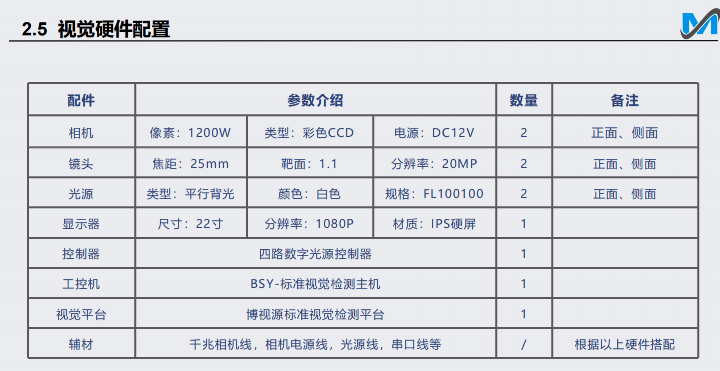

## 自我介绍
之前在公司负责项目的解决方案，硬件的选型，程序的编写与调试，主要负责汽车行业和3c电子行业的产品检测，做过电子元器件的识别，包括芯片，金属部件，中框内长内宽，等元器件的检测，以及汽车门板检测，检测其中螺丝，卡扣，海绵条等部件有没有错装漏装，还有冲压件的产品检测，检测其硬度是否合格，测量冲击后的产品，距离，角度，是否出现错位，损坏。

## 实际项目

### 气泡杂质检测

- 检测注塑工件部的气泡和杂质

### 线缆颜色识别

- 通过颜色测量工具，对线缆颜色进行分析判断，确保线缆插线的位置准确

### IC元件PIN针检测和字符识别

- 检测IC元件PIN脚的平整度、间距及表面激光雕刻的字符识别

### CB3(圆形电池底片)

- 测量圆柱电池滚槽后垫片的尺寸大小，垫片为蓝色金属， 定位并测量底片的半径，看是否与电池

### 手机MIC贴合定位

- 手机屏Mic定位，以达到准确定位

### RL5

- 识别包装盒背面标签二维码及字符，检测标签是否偏移，是否在正确的位置

### LCD玻璃定位贴合项目 

贴合前需要一些准备,对玻璃的进行清洁,确保贴合面干净,把相机和光源安装在合适的位置,进行校准与调试,当时用了两个相机,.一个相机用于拍摄玻璃的正面,另一个用于拍摄侧面,获取更多的特征信息,然后三个光源,环形光用于提供均匀的照明,突出边缘的特征,背光源使轮廓更加清晰,条形光用于检测玻璃表面的缺陷,确保检测区域无干扰,光照条件稳定均匀,接着通过机械手吸取产品移动九个位置通过相机分别拍照九个位置的图像,获得九组像素坐标, 再把像素坐标转换为机械坐标, 把九组机械手的坐标对应的视觉坐标填入 Visionpro的九点标定工具中进行校正获取标定结果,查看误差值,一般是5,也就是正负0.5精度,之后再通过相机采集工作场景的图像,进行一些预处理(调整图像参数,对比度,亮度,去噪,平滑等处理),识别玻璃的特征,尺寸,位置等信息,再通过标定抓取玻璃的特征标记,旋转三个角度,分析信息,找出旋转中心,计算得出目前玻璃放置的位置是否准确,和标准位置相比有多少的位移差,并反馈当前的 X/Y 坐标值到 PC 控制系,以确保后面进行准确定位,之后将玻璃胶水初步放置在显示屏框架上,通过机械手臂进行粗略定位,通过调整参数精准的贴合到指定位置,贴合过程中确保压力均匀,过大压力可能导致贴合不牢固玻璃破裂,贴合后进行检测,是否存在位置偏移,存在气泡,GRR一般做到10%以内,根据评估标准来判断是否符合要求,最后记录生成报告.

### 键盘键帽缺失检测

用了两个相机,一个远心相机,用于检测对象的成像,一个微距镜头,用于键帽面的表面纹理的检测,两个光源,环形光,减少阴影和反光,突出键帽的轮廓和边缘,条形光使键帽表面的特征更明显,有助于更好的提取特征.把相机和光源安装在合适的位置,进行校准与调试,对采集的图像进行去噪预处理,以减少后续的干扰,进行灰度化处理,简化图像,突出键帽的特征.通过VP软件中的模板匹配或特征提取的方式查找键帽的位置,然后再使用斑点,对比等工具针对每个键帽,提取能够表示其存在与否的特征(面积,形状,灰度值等),将提取的特征与预设的正常键帽特征比较,如果差异超过设定的阈值,则判断为缺失,同时检测键帽表面的字符是否存在划痕,或缺失,将检测结果图像上标记出缺失键帽的位置以可视化的形式输出.生成相应的报告,之后通过大量的样本测试,进行优化,提高检测的准确率.(如果问到,准确率,召回率,GRR是多少,精度什么的)

### 螺母的筛选检测

本项目用了三个相机,一个拍摄螺母的表面,一个拍摄底面,一个拍摄侧面,三个光源,环形光检测表面,背光检测背面,条形光检测侧面,将待检测的螺母放到转盘上,启动转盘螺母将依次被相机拍摄,通过调整相机拍摄的图像,提取能够表示其存在与否的特征(面积,形状,灰度值等),将提取的特征与预设的正常螺母特征比较,如果差异超过设定的阈值,则通过后面的气泵时,不良品的气泵吹动,将产品吹入不良品盒子中,生成报告,之后通过大量的样本测试,进行优化,提高检测的准确率.

## 电子元器件

项目硬件

1200w彩色相机

碗状光，低角度打光

项目流程

查找边上的焊锡是否缺焊，锡多，使用斑点工具，查看面积，高度，宽度，数量，位置

根据周围固定样式进行芯片方向识别，进行均值滤波，去除干扰因素，拿原图，与均值滤波的图片进行相减

将相减参数调为绝对值，因为，脏污，划痕有黑有白。

## 汽车门板检测

**项目硬件：**

产品尺寸：780mm*750mm

两个2000w像素彩色相机

8mm焦距镜头

工作距离1200mm

条形光源：两边由上而下照射

**项目流程**

开始-产品到达检测位置-设备触发拍照-视觉软件处理产品图片-处理结果-ok-结束

界面三色灯 为红色 ng- 人工介入检测-判断是否复检  - 否 -结束

是- 产品拿回检测位置

**检测A面：**

漏装：斜扶手、喇叭盖

错漏装：扶手、上饰板、喇叭罩

**检测B面：**

漏装：螺丝-43个、焊点（穿刺焊、片筋焊）、海绵条

错漏装：卡扣

氛围灯颜色顺序是否错乱

螺丝检测：有垫片，有螺丝。有垫片，无螺丝。 根据灰度值二值化查找，

海绵条有无：进行建模

**焊点穿刺焊图像预处理与增强**

针对焊点的反光干扰，增加了图像预处理步骤，包括对比度增强、边缘检测、去噪处理等。

针对焊点反光问题，进行了相机和光源的多角度测试，最后确定了利用偏振镜和低角度照明结合的方案，显著减少了反光干扰。

## 硬度冲击检测

**项目硬件：**

1200W相机

焦距25mm

光源面光

相机视野为：50mm*38mm

**项目流程**

产品通过人工放置到传送带上，通过相机对震动盘中的产品进行距离和硬度的检测，并将其放置到流水线上，如果产品不合格则剔除，合格的产品会被放到合格框中
